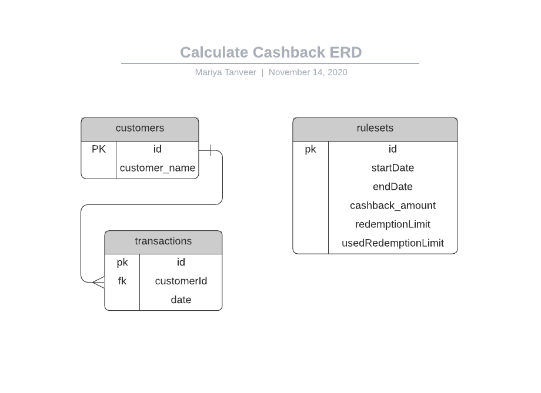

# Calculate Cashback

This API is to calculate the cashback for some transactions based on the rulesets provided.

## Attachments

- [Requirement document](docs/calculate-cashback-requirements.pdf)
- [Postman Collection](docs/Calculate Cashback.postman_collection.json)

## Tech Stack Used

- NodeJs v12.19.0
- Backend: ExpressJs v4.16.1
- Backend Runner: Nodemon V2.0.6
- DotEnv: To maintain environments

## How to Run?

Open a terminal to run the backend side API:

```bash
$ npm i
$ cp .env.example .env
$ npm start
```

Create database and run this command in project root

```bash
$ sequelize db:migrate
```

This should get the server API up and running and accessible at http://localhost:3000/ in postman. You can get and import postman collection [here](docs/Calculate Cashback.postman_collection.json) to play with API endpoints.

## ERD for the database



## Project structure

### API

```
config
 | - config.json
controllers
 | - cashback // for cashback route
 | - customer // for customer routes
 | - ruleset // for ruleset routes
 | - transaction // for transaction routes
middlewares
 | - body-parser.js // handle content parsing
 | - catch-404.js // handle 404 errors
 | - cookie-parser.js // handle cookie parsing
 | - error-handler.js // handle errors
 | - logger.js
migrations
 | - create-transaction // create table: transaction and handle relation: customer
 | - create-ruleset // create table: rulesets
 | - create-customer // create table: customers and handle relation: transactions
models
 | - customer.js
 | - ruleset.js
 | - transaction.js
 | - index.js // to collectively handle models
public
 | - hanlde assets: images, javascripts, stylesheets
routes
 | - cashback // cashback routes
 | - customer // customer routes
 | - index // merge and export all routes collectively
 | - main // main routes
 | - ruleset // ruleset routes
 | - transaction // transaction routes
views
 | - error.ejs
 | - index.ejs
app.js // main launching file for api
package.json // npm dependencies for api
```

### docs

```
docs
 | - api-postman-collection.json // api postman collection, to import and hit the routes locally
 | - Calculate Cashback ERD.png // erd
 | - calculate-cashback-requirements.pdf // requirement document given
```

## License

[MIT](https://choosealicense.com/licenses/mit/)
